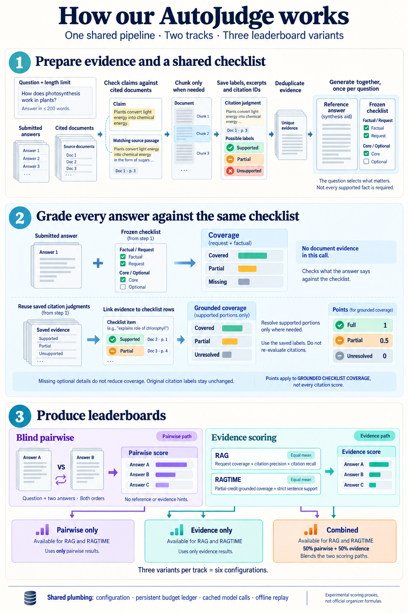

# Shared judge baseline

## Architecture overview



[Open the full-resolution architecture image](images/autojudge-architecture.png).
The example question and document excerpts in the illustration are synthetic.

Read the visual in three sections:

1. **Prepare once per question:** check claims against cited documents, split
   overlong documents when needed, deduplicate evidence, and generate a reference
   answer plus one shared checklist. The checklist distinguishes factual from
   request requirements and core from optional items.
2. **Grade each answer:** measure checklist coverage separately from evidence
   support, then join coverage to saved citation judgments. Resolve supported
   portions only where necessary; do not automatically rejudge citations.
3. **Rank systems:** choose blind pairwise, track-specific evidence scoring, or
   their configured combination. The blind pairwise path bypasses reference and
   evidence generation. Aggregate answer-level results across questions into
   system leaderboards.

Partial credit of 0.5 in the visual applies to grounded checklist coverage—not
to every citation metric. Scores are experimental proxies, not official metric
implementations. The diagram explains the implemented baseline; it does not
certify full-track submission readiness.

## Configuration and scoring

One shared pipeline, separate RAG and RAGTIME proxies. The existing citation
workflow remains intact. `judges/generic/unified-workflow.yml` has six variants:
`rag-pairwise`, `rag-evidence`, `rag-combined`, and their `ragtime-*` equivalents.

Evidence path: grouped document support -> deduplicated evidence -> reference
and one factual/request, core/optional checklist -> per-answer coverage ->
joins to saved citation judgments -> optional supported-portion alignment.
Pairwise path: blind comparisons in both orders, aggregated into win points.

RAG evidence is the equal mean of request coverage and strict unweighted citation
precision/recall. RAGTIME evidence is the equal mean of partial-credit factual
grounded coverage and strict sentence support. Grounded full=1, partial=0.5,
unresolved=0; optional and request-only items do not enter factual coverage.
Combined defaults to 0.5 pairwise + 0.5 evidence. These are experimental proxies,
not claimed official organizer formulas. All component scores are exported.

The endpoint/model are injected. Set CACHE_DIR for portable completion caching;
`OPENAI_BASE_URL=EMPTY` replay must complete without network requests. Budget
reservations persist across failures; no automatic resend of uncertain calls.
No command here uploads or submits anything.

```bash
python -m judges.generic.runner --stage unified --track ragtime \
  --method combined --input-dataset /path/to/dataset --out-dir output/my-run
```

Configure pair/input limits explicitly for larger cohorts. Default limits are
smoke-test bounds, not a claim that full tracks fit. Keep the same model and
prompts for cache replay. Do not inspect restricted 2026 report artifacts.

Validation before integration: six variants replayed twice with identical scores
on unrestricted 2025 data (58 RAGTIME answers, 3 RAG answers). On 57 RAGTIME
answers with released almost-human nugget coverage, adopting partial grounding
changed evidence Spearman 0.289 -> 0.478 and combined 0.685 -> 0.629. Mixed
single-question results, not proof of full-track accuracy. No weights were tuned.

Sol, Astra, Opus, and Gemini reviewed the scoped integration. Confirmed audit,
saved-resolution replay, and run-alignment findings were fixed and tested.
The entire new pipeline has not been certified for full-track submission.
